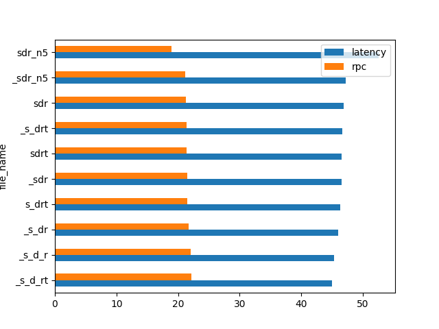

# Validation fastapi

## About

The purpose of the project is to compare the `fastapi` performance
with different levels of working with `pydantic models`.

## Benchmark

### Annotation

`rpc` - requests per seconds

The names are made up of actions at handler:

* `s` - **serialization**. E.g. `model.json(); model.dict()`
* `d` - **deserialization**. E.g. `PydanticModel.parse_raw(raw_json)`
* `r` - **response model**. The `response_model`
argument in fastapi handler decorator. E.g. `app.get("", response_model=MyModel)`
* `t` - **transformation**. Data transformation, E.g. from one model to another.
* `_` - **NOT**. E.g. `_s` means **without serialization**
* `{number at the end}` - number of operation inside the handler.

## Table

| file_name | latency | rpc   |
|-----------|---------|-------|
| _s_d_rt   | 45.03   | 22.16 |
| _s_d_r    | 45.3    | 22.04 |
| _s_dr     | 46.01   | 21.71 |
| s_drt     | 46.36   | 21.51 |
| _sdr      | 46.51   | 21.46 |
| sdrt      | 46.56   | 21.44 |
| _s_drt    | 46.71   | 21.35 |
| sdr       | 46.9    | 21.28 |
| _sdr_n5   | 47.2    | 21.17 |
| sdr_n5    | 52.62   | 18.95 |
